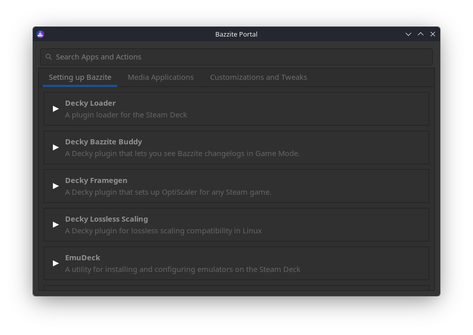

# Bazzite Portal




A GTK3 interface for the Bazzite Portal, providing quick access to various useful scripts, fixes, and QOL tweaks for the terminal averse.

The default configuration file is located at:
```
/usr/share/yafti/yafti.yml
```

## Building from Source

review the justfile for all recipies. You can stack just commands together, for example:

```bash
just build install run
```

This will build the flatpak inside a container, install to host, then run it with the default source file.

## Running

The application requires a YAML configuration file path as a command-line argument.

### On Bazzite (default config)

```bash
flatpak run com.github.yafti.gtk /run/host/usr/share/yafti/yafti.yml
```

### With Custom Config

```bash
flatpak run com.github.yafti.gtk /path/to/custom/yafti.yml
```

### Desktop Shortcut

The installed desktop file automatically launches with the default Bazzite config path. You can find it in your application menu as "Bazzite Portal".

## Configuration

The app reads a `yafti.yml` configuration file to populate tabs and actions. The YAML file should follow this structure:

```yaml
screens:
  - title: "Category Name"
    actions:
      - title: "Action Title"
        description: "Optional description"
        script: "command to run"
```
